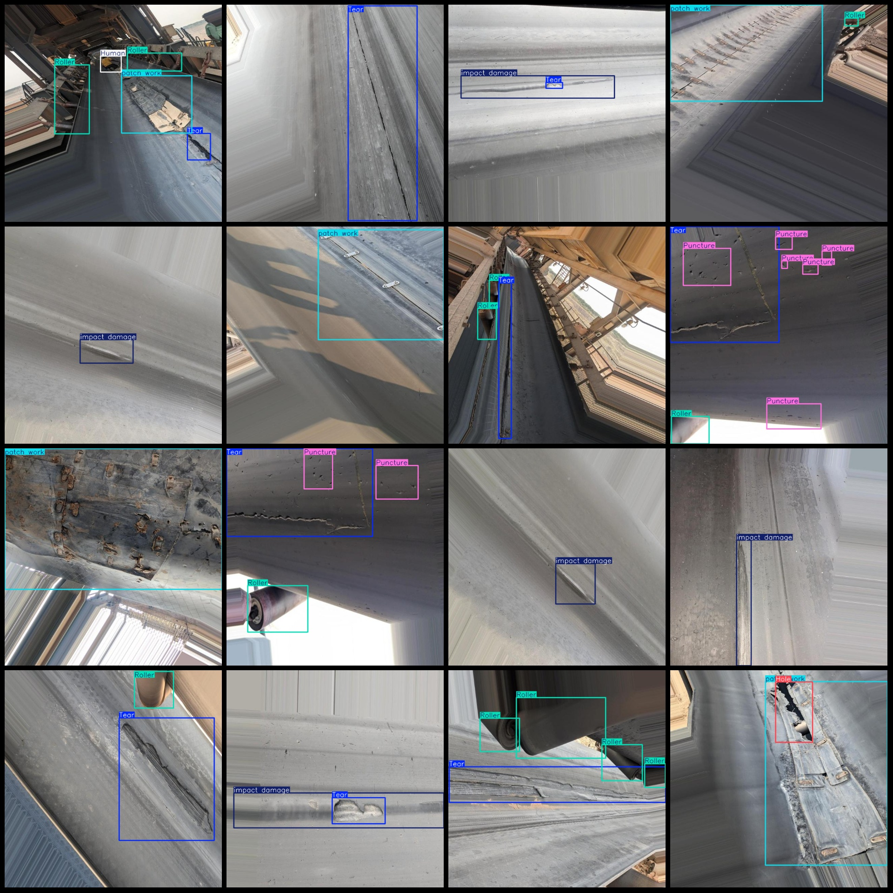

# Dataset for Damage Detection on Transfer Belt with YOLO+VOC format and 918 images in 8 categories

Dataset format: Pascal VOC format + YOLO format (txt file without segmentation path, only containing jpg images and corresponding VOC format xml files and yolo format txt files)
Number of images (jpg file count): 918
Number of annotations (xml file count): 918
Number of annotations (txt file count): 918
Number of annotation categories: 8
Repository: firc-dataset
Annotation category names (note that the order in the yolo format is not consistent with this, and should be based on the labels folder's classes.txt): ["Hole", "Human", "Other Objects", "Puncture", 
"Roller", "Tear", "impact damage", "patch work"]
Box counts for each category:
Hole (hole) boxes = 42
Human (person) boxes = 118
Other Objects (other objects) boxes = 130
Puncture (puncture) boxes = 120
Roller (roller) boxes = 681
Tear (tear) boxes = 691
impact damage (impact damage) boxes = 283
patch work (patch work) boxes = 405
Total box count: 2470
Image resolution: 640x640
Annotation tool used: labelImg
Annotation rules: draw a box around the category
Important note: No special declarations are made regarding the accuracy of the trained models or weight files
Special declaration: This dataset does not guarantee any accuracy of the trained models or weight files
Image preview:
## Images

Here is a pay link on Stripe ( https://buy.stripe.com/3cs8yP7sY87d0vu9AB ). Please contact me lonlonago@foxmail.com after funding $89, and I will send you a complete data files , thank you!

